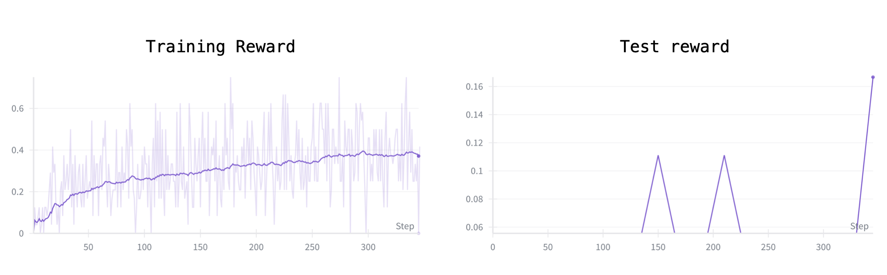

<div align="center">

# Tau-Retail End-to-End RL Experiment

</div>

This repository presents a **reinforcement learning (RL) recipe** designed to enhance *end-to-end agentic capabilities*, inspired by the [τ-bench](https://github.com/sierra-research/tau-bench) framework.

For this study, a **retail domain** was selected as the experimental testbed (personal preference).  
The environment was deliberately restricted to only two action types—`exchange` and `cancel`—to narrow the agent’s operational scope and focus exclusively on these tasks.  
This specialized setup, referred to as **`τ-retail-exchange-cancel`**, was motivated by the observation that excessively long input prompts often leave insufficient space for meaningful responses.

Despite this controlled setting, initial results are **not highly encouraging**.  
The findings suggest that it remains challenging for an RL-based agent to:

1. **Strategically query** the user for missing or clarifying information  
2. **Perform effective multi-hop tool calls** to achieve the intended outcome

---

<div align="center">

</div>

> **Note:** Both reported rewards correspond to *pass¹*.  
> The training dataset contains **208 samples**, and the test dataset contains **18 samples**.

---

## Main Results

### `τ-retail-exchange-cancel`

| Strategy       | Pass¹  |
| -------------- | ------ |
| [TC (claude-3-5-sonnet-20241022)](https://www.anthropic.com/news/3-5-models-and-computer-use) | ??     |
| [TC (gpt-4o)](https://platform.openai.com/docs/guides/function-calling) | ??     |
| Qwen2.5-3B-Instruct-finetuned | 0.167 |
| Qwen2.5-3B-Instruct | 0.066 |

*TC = `tool-calling` strategy (as described in the τ-bench paper)

---

## Quick Start

### 1. Installation

Refer to the [VERL installation guide](https://verl.readthedocs.io/en/latest/start/install.html) for detailed setup instructions.

### 2. Dataset Preprocessing

Run the preprocessing script:

```bash
python -m examples.data_preprocess.tau_retail.preprocess_tau_retail_dataset
````

You should see output similar to:

```bash
[{'name': 'exchange_delivered_order_items', 'kwargs': '{"order_id": "#W3947049", "item_ids": ["3358616356"], "new_item_ids": ["9013366374"], "payment_method_id": "credit_card_7901829"}'}]
[{'kwargs': '{"order_id": "#W3947049", "item_ids": ["3358616356"], "new_item_ids": ["9013366374"], "payment_method_id": "credit_card_7901829"}', 'name': 'exchange_delivered_order_items'}]
train dataset len : 208
test dataset len : 18
```

### 3. Training

> **Hardware requirement:** At least **H100 × 8 GPUs** are recommended to reproduce the results.

```bash
export OPENAI_API_KEY=<YOUR-API-KEY>
nohup bash examples/sglang_multiturn/run_qwen2.5-3b_tau_retail_multiturn.sh > train.log 2>&1 &
```

---

## Citation

If you use this repository in your research or work, please cite it as follows:

```bibtex
@misc{tau_retail_rl,
  title        = {Tau-Retail End-to-End RL Experiment},
  author       = {Seungyoun, Shin},
  year         = {2025},
  url          = {https://github.com/SeungyounShin/tau-retail-rl}
}
```
