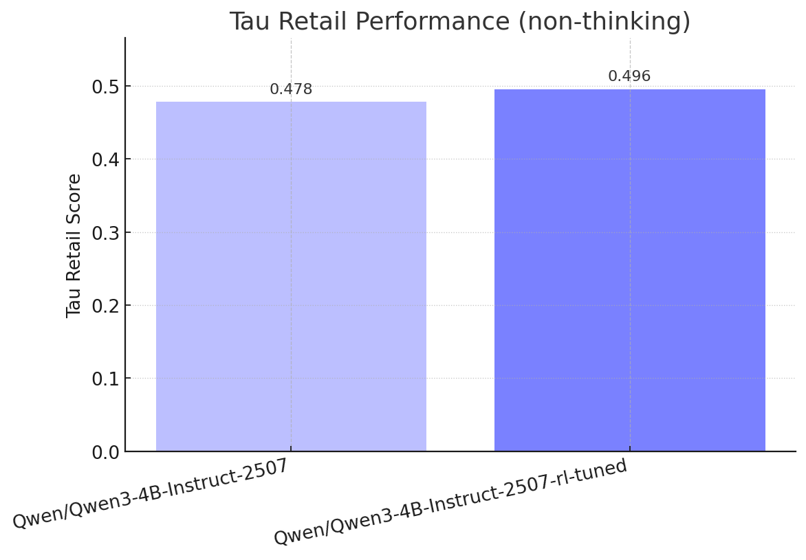

<div align="center">

# Tau-Retail End-to-End RL Experiment

</div>

This repository presents a **reinforcement learning (RL) recipe** designed to enhance *end-to-end agentic capabilities*, inspired by the perspective in [**The Second Half**](https://ysymyth.github.io/The-Second-Half/) that realistic progress now hinges on **defining problems & evaluations**.  
We provide a **full τ-bench retail (`τ-retail`) environment** to train and evaluate agents on **policy-following**, **strategic clarification**, and **multi-hop tool use** in realistic, rule-bound workflows.

Despite the controlled setup, initial results highlight that it remains challenging for an RL-based agent to:

1. **Strategically query** the user for missing or clarifying information  
2. **Perform effective multi-hop tool calls** to achieve the intended outcome

---

<div align="center">

</div>

> **Key takeaway:** RL-tuned model improves the Tau Retail score **0.478 → 0.496** (**+0.018 abs., +3.8% rel.**) in the non-thinking setting.

> **Note:** Reported rewards correspond to *pass^1*.  
> The training dataset contains **500 samples**, and the test dataset contains **115 samples**.

---

## Main Results

### `τ-retail` (full tools)

| Strategy                                  | Pass^1 |
|-------------------------------------------|-------:|
| [TC (claude-3-5-sonnet-20241022)](https://www.anthropic.com/news/3-5-models-and-computer-use) | TBD    |
| [TC (gpt-4o)](https://platform.openai.com/docs/guides/function-calling) | TBD    |
| Baselines                                  | TBD    |

*TC = `tool-calling` strategy (as described in the τ-bench paper)

---

## Quick Start

### 1. Installation

Refer to the [VERL installation guide](https://verl.readthedocs.io/en/latest/start/install.html) for detailed setup instructions.

### 2. Dataset Preprocessing

```bash
python -m examples.data_preprocess.tau_retail.preprocess_tau_retail_dataset
````

You should see output similar to:

```bash
train dataset len : 500
test dataset len  : 115
```

### 3. Training

> **Hardware requirement:** At least **H100 × 8 GPUs** are recommended to reproduce the results.

```bash
export OPENAI_API_KEY=<YOUR-API-KEY>
nohup bash examples/sglang_multiturn/run_qwen2.5-3b_tau_retail_multiturn.sh > train.log 2>&1 &
```

---

## Citation

If you use this repository in your research or work, please cite it as follows:

```bibtex
@misc{tau_retail_rl,
  title        = {Tau-Retail End-to-End RL Experiment},
  author       = {Seungyoun, Shin},
  year         = {2025},
  url          = {https://github.com/SeungyounShin/tau-retail-rl}
}
```